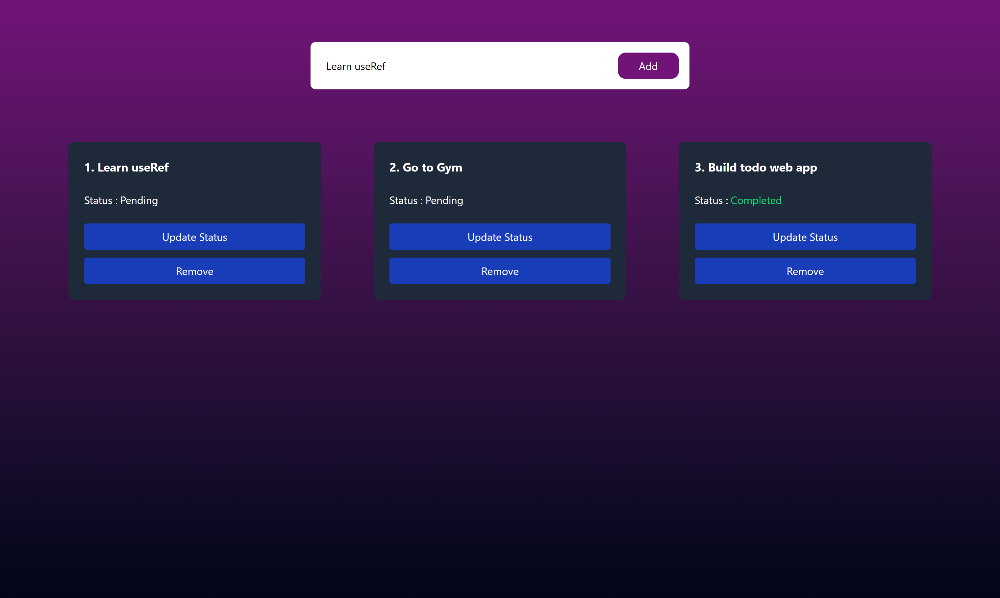
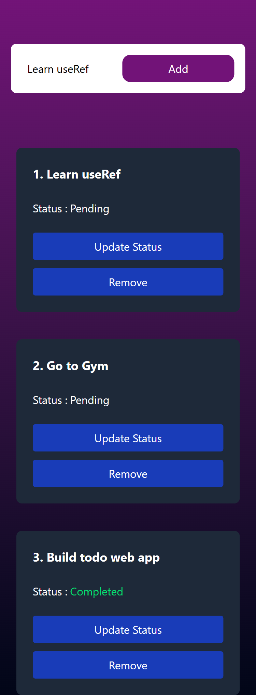

# ToDo App

A simple and responsive ToDo application built with **React** and styled using **Tailwind CSS**. This app allows users to add, update, and remove tasks, along with marking tasks as complete or pending.

## 🚀 Features

- ✅ Add new tasks
- 🔁 Toggle task status (Completed / Pending)
- ❌ Remove tasks
- 📱 Fully responsive layout
- 🎨 Styled with Tailwind CSS

## 🛠️ Tech Stack

- **React** (with functional components and hooks)
- **Tailwind CSS**
- **JavaScript (ES6)**

## Screenshots

- Large Screen
  

- Small Screen
  

## Links

- [Live Demo](https://todowebappassign02p01.netlify.app/)
